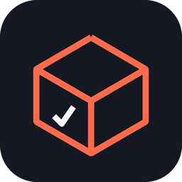

<div align="center">



# DQX Forge

**Build your Databricks Lakehouse data quality framework without leaving the IDE.**

Profile tables, author quality contracts in a visual editor, dry-run them on serverless compute, and ship scheduled jobs and a quality dashboard through Databricks Asset Bundles — all versioned in Git.

[](LICENSE)
[](https://code.visualstudio.com/)
[](https://github.com/databrickslabs/dqx)

</div>

---

## What it does

[DQX](https://github.com/databrickslabs/dqx) is Databricks Labs' data quality framework. It is powerful, but getting from "I have a table" to "I have a scheduled quality job and a dashboard" means writing YAML by hand, wiring notebooks, and assembling a bundle yourself.

DQX Forge closes that gap. It turns quality rules into **versioned contracts** in your repository and generates everything the Lakehouse needs around them:

| Step | What you do | What the extension does |
| --- | --- | --- |
| **Explore** | Browse Unity Catalog in the sidebar | Lists catalogs, schemas and tables you can access |
| **Profile** | Right-click a table → *Generate contract from profiling* | Runs DQX profiling on serverless compute and proposes rules from the real data |
| **Author** | Edit rules in a visual editor | Validates every check against the installed DQX version and the table schema |
| **Try** | Click *Dry run* | Applies the checks to a sample, shows violations per check and sample failing rows |
| **Ship** | *Generate bundle resources* → *Deploy* | Writes the job, the dashboard and the runner script, then deploys via the Databricks CLI |

Everything the extension produces is a plain file in your repository. There is no hidden state, no proprietary format, and no server in the middle.

## Requirements

- **VS Code 1.95** or newer.
- **[Databricks CLI](https://docs.databricks.com/dev-tools/cli/install.html)** on your `PATH`, with an authenticated profile in `~/.databrickscfg`:
  ```bash
  databricks auth login --host https://<your-workspace>.cloud.databricks.com
  ```
- **Unity Catalog**, plus a volume the extension can write to. It can create one for you if you have `CREATE VOLUME` on a schema.
- **A SQL warehouse** — only needed for the AI agent and the quality dashboard. Everything else works without one.

Serverless compute must be enabled in the workspace: profiling, dry runs and the scheduled jobs all run as serverless Python tasks.

## Install

From the [Visual Studio Marketplace](https://marketplace.visualstudio.com/items?itemName=arthurfr23.dqx-forge) — search for **DQX Forge** in the Extensions tab, or:

```bash
code --install-extension arthurfr23.dqx-forge
```

<details>
<summary>Or install a specific release from a .vsix</summary>

1. Download `dqx-forge.vsix` from the [latest release](https://github.com/arthurfr23/dqx_forge/releases/latest).
2. **Extensions** → `…` menu → **Install from VSIX…**, or `code --install-extension dqx-forge.vsix`.
3. Reload the window.
</details>

<details>
<summary>Or build it from source</summary>

```bash
git clone https://github.com/arthurfr23/dqx_forge.git
cd dqx_forge
npm install
npm run vsix          # produces dqx-forge.vsix
code --install-extension dqx-forge.vsix
```
</details>

## Getting started

Open the **DQX Forge** view in the Activity Bar. Every row under **Setup** opens a picker that reads the real options from your workspace — you never have to edit `settings.json` by hand.

| Setting | What it is | Required |
| --- | --- | --- |
| Workspace | Profile from `~/.databrickscfg` used for every call | Yes |
| Artifacts volume | Where jobs write their run results | Yes |
| Contracts folder | Where contracts are versioned in the repo (default `dq/contracts`) | Yes |
| DQX version | Version of `databricks-labs-dqx` installed on the jobs | Yes |
| SQL warehouse | Used by the AI agent and the dashboard | Optional |
| AI model | Where the AI runs: served on Databricks, or your IDE subscription | Optional |
| Schedule | How often generated jobs run — presets or a Quartz expression | Optional |
| Language | Interface language: English, Português or Español | Optional |

Then, a first run end to end:

1. **Pick a table** in the Unity Catalog view and choose *Generate contract from profiling*. DQX inspects the data and proposes checks.
2. **Review them** in the editor. Add checks from the catalog on the right, set criticality (`error` blocks, `warn` only annotates), and choose what happens to failing rows — annotate in place, or quarantine into a separate table.
3. **Dry run** to see how many rows each check would reject before anything is written.
4. **Save** — the contract lands in `dq/contracts/<catalog>.<schema>.<table>.yml`, ready to commit.
5. **Generate bundle resources**, then **Deploy to Databricks**.

## What lands in your repository

Running *Generate bundle resources* builds a complete Databricks Asset Bundle around your contracts:

```
databricks.yml                          created only if missing — yours to edit afterwards
dq/contracts/<catalog>.<schema>.<table>.yml
dq/dashboard/dqx_quality.lvdash.json    seeded from the bundled dashboard
resources/dq_jobs.yml                   generated, rewritten every time
resources/dq_dashboard.yml              generated, only when a SQL warehouse is set
src/dqx_runner/apply_task.py            generated, the script the job runs
```

Generated files are rewritten on every run and should not be edited by hand. Your contracts and `databricks.yml` are never overwritten.

The contracts folder is configurable. The **last two segments** of the path become the contracts folder inside the bundle, and anything before them is the bundle root — so `dq/contracts` puts the bundle at the repository root, while `platform/dq/contracts` roots it at `platform/`.

### Contract format

```yaml
meta:
  table: main.sales.orders
  layer: silver
  generated_by: ai_agent
  generated_at: 2026-08-16T12:00:00.000Z
output:
  mode: quarantine                      # or: annotate
  output_table: main.sales.orders_valid
  quarantine_table: main.sales.orders_quarantine
  metrics_table: main.sales.dq_metrics
checks:
  - criticality: error
    name: order_id_not_null
    check:
      function: is_not_null
      arguments:
        column: order_id
    user_metadata:
      dimension: completeness
```

The `checks` list is DQX's own format, passed straight to the engine — a contract stays usable by any DQX installation. The `meta` and `output` blocks are DQX Forge's, and describe what the generated job should do with the results.

`error` checks route rows to quarantine. `warn` checks are non-blocking: the row still reaches the output table **and** is surfaced in quarantine for review, which is DQX's behaviour — expect a row with only warnings to appear in both.

## Scheduling

Pick a periodicity in **Setup → Schedule**: every 15/30 minutes, hourly, every 6 hours, daily, weekdays, weekly, none, or a raw Quartz expression.

Databricks uses **Quartz** cron, which is not the 5-field Unix cron:

```
0 0/30 * * * ?
│ │    │ │ │ │
│ │    │ │ │ └─ day of week
│ │    │ │ └─── month
│ │    │ └───── day of month
│ │    └─────── hour
│ └──────────── minute
└────────────── second
```

Six fields (seven with a year), and exactly one of *day of month* / *day of week* must be `?`. The extension validates the expression as you type and explains what is wrong instead of letting the deploy fail later.

Generated jobs are created **paused**. Whoever reviews the pull request decides when a production job starts running.

## Importing existing rules

If you already have DQX rules somewhere, *Import existing contract* brings them in through three routes:

- **A checks file** — a raw DQX check list, a contract exported by DQX Forge, or a `{ "checks": [...] }` wrapper, in YAML or JSON.
- **An ODCS data contract** — Open Data Contract Standard v3.x. DQX derives rules from the schema and the `quality` section; the conversion runs on Databricks.
- **A checks table in Unity Catalog** — the migration path for teams already running DQX from a Delta table.

Every imported check is validated against your table schema and the installed DQX version. Anything that no longer resolves is rejected with a reason instead of being silently saved.

## Data handling

The extension moves data, so here is exactly what goes where.

**Credentials.** It uses the profile already in your `~/.databrickscfg` via the Databricks CLI. It never asks for, stores or transmits a token, and it can never reach anything your own Unity Catalog permissions do not already allow.

**What it writes.**

| Location | Contents | Lifetime |
| --- | --- | --- |
| `<volume>/runs/` | Return payload of each interactive run — dry run, profiling, import, check catalog. **A dry-run payload includes a sample of the failing rows**, which is real table data. | Deleted as soon as the extension reads it |
| `<volume>/runs/<target>/` | Scheduled job results: table, mode, destinations, status. No data rows. | Overwritten on each run |
| `/Users/<you>/.dqx_forge/tasks/<hash>/` | The Python task scripts, uploaded to your workspace | Replaced per script version |
| Your repository | Contracts and the generated bundle resources | Versioned by you |

**The AI agent.** Choosing a model *served on Databricks* keeps every byte inside the workspace. Choosing a model *in the IDE* (Copilot, Claude, …) sends data samples to that model's provider under your own subscription. The trade-off is spelled out in the model picker.

**What it does not do.** No telemetry, no calls to any server operated by the author, and no persistence outside your Databricks workspace and your repository.

**Your responsibility.** Grants on the volume and the tables, which volume you point it at, retention of what accumulates there, and unpausing jobs in production. A volume whose grants are broader than the source tables will expose whatever is written to it to anyone holding `READ VOLUME`.

## Commands

Every command is available from the Command Palette under `DQX Forge:`.

| Command | Purpose |
| --- | --- |
| Select Databricks profile | Choose the workspace connection |
| Refresh catalog | Reload the Unity Catalog tree |
| Generate contract from profiling | Profile a table and propose checks |
| Generate contract with AI | Let a model investigate the data and propose rules |
| New quality contract | Start an empty contract for a table |
| Import existing contract | Bring in rules from a file, an ODCS contract or a table |
| Reload DQX check catalog | Re-read the check functions from the installed DQX |
| Choose job schedule | Set the periodicity of generated jobs |
| Generate bundle resources | Turn contracts into bundle files |
| Deploy to Databricks | Validate and deploy the bundle |
| Run a contract's checks | Trigger a quality job on demand |
| Show log | Open the output channel |

## Troubleshooting

**"No profile found in ~/.databrickscfg"** — run `databricks auth login --host <workspace-url>`, then pick the profile in Setup.

**A job fails right after deploy** — check that the artifacts volume is set. Without it the generated output path is invalid and the failure only surfaces at run time.

**The dashboard is empty** — it reads the metrics, quarantine and validated tables the contract declares, so it only has data after the job has run at least once. If a contract has no `metrics_table`, the Overview page stays blank while the other pages still work.

**A serverless run takes minutes on the first try** — that is the compute starting from scratch. Subsequent runs in the same session are much faster.

**Anything else** — *Show log* has the full CLI and API exchange, and job failures now carry the underlying error message rather than a generic "workload failed".

## Development

```bash
npm install
npm run compile      # build into dist/
npm run watch        # incremental build
npm run typecheck    # tsc --noEmit
npm run vsix         # package dqx-forge.vsix
```

`F5` launches an Extension Development Host with the extension loaded.

The Python task scripts live in `tasks/`, are copied into `dist/tasks/` at build time and shipped inside the `.vsix`. `apply_task.py` is also written into the user's repository during resource generation, because the scheduled job references it by relative path; the others are uploaded straight to the workspace for interactive runs.

`resources/dashboard/dqx_quality.lvdash.json` is the quality dashboard, seeded into a user's repository when they do not have one yet. Its parameters are rewritten with the project's real tables during generation, so the placeholders in the file are never what ships.

It is built around the three tables the contract declares — validated, quarantine and metrics — rather than discovering tables through `information_schema`. The time axis is `run_time` from the metrics table, which always exists, instead of a business date column, which most tables do not have. That is a deliberate departure from the dashboard bundled with DQX itself: it is smaller and works without configuration, at the cost of covering one contract at a time.

Contributions are welcome — see [CONTRIBUTING.md](CONTRIBUTING.md).

## License

MIT — see [LICENSE](LICENSE).

DQX Forge is an independent project. It is not affiliated with or endorsed by Databricks, and [DQX](https://github.com/databrickslabs/dqx) itself is a Databricks Labs project under its own license.
